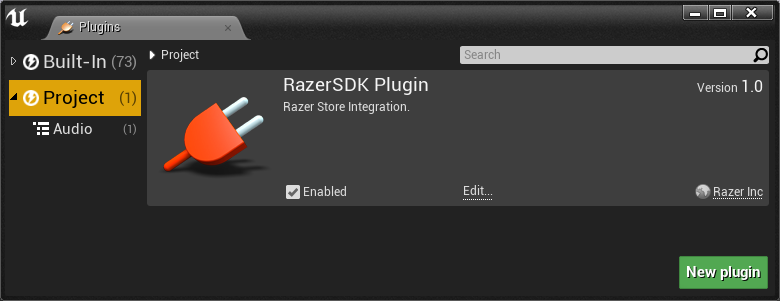
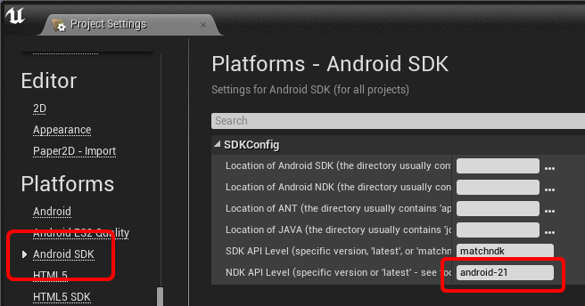
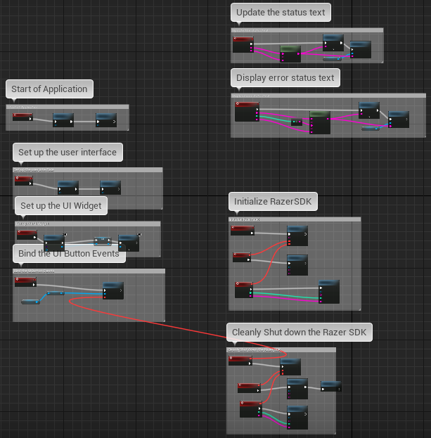
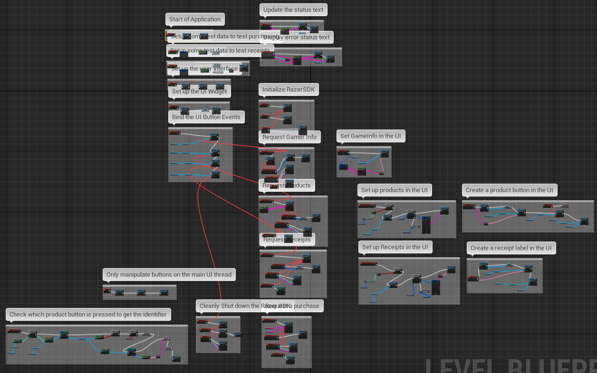
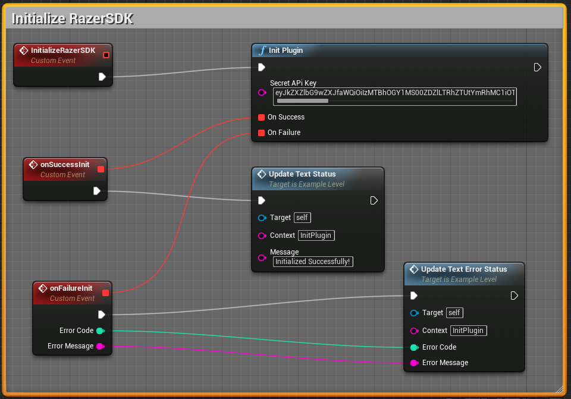
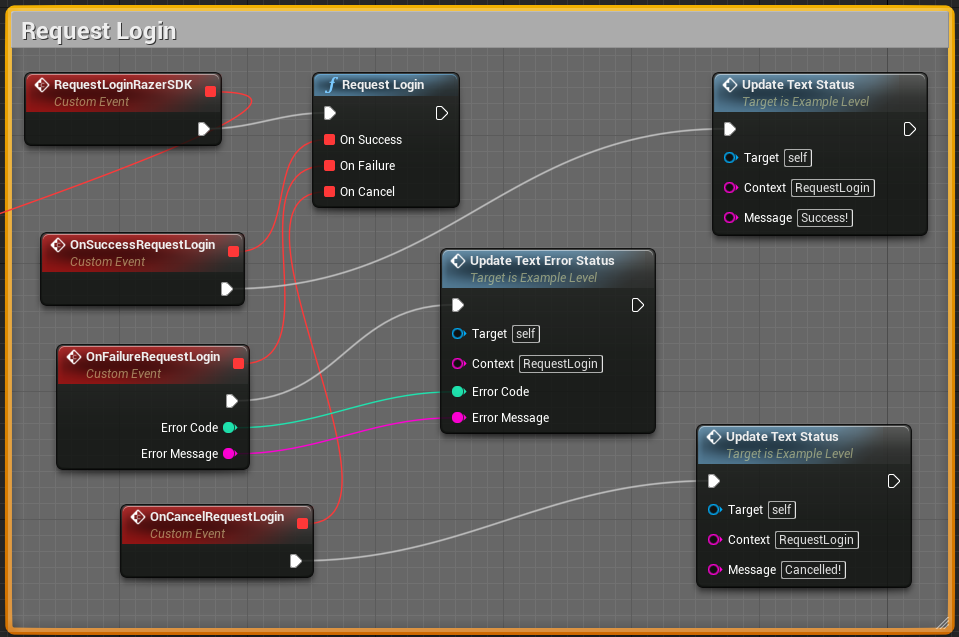
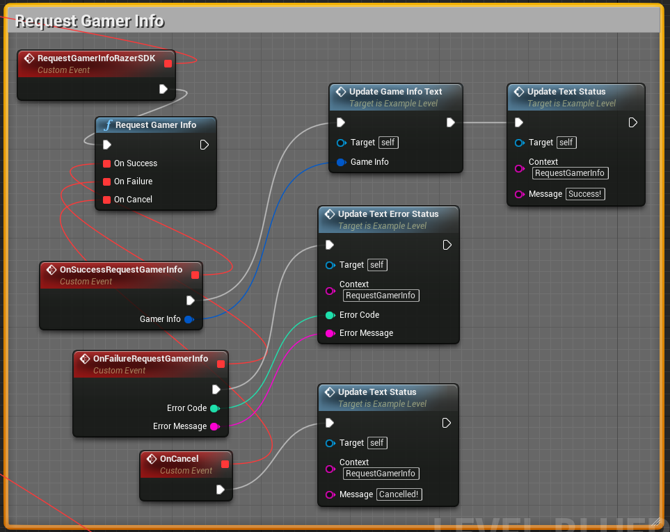
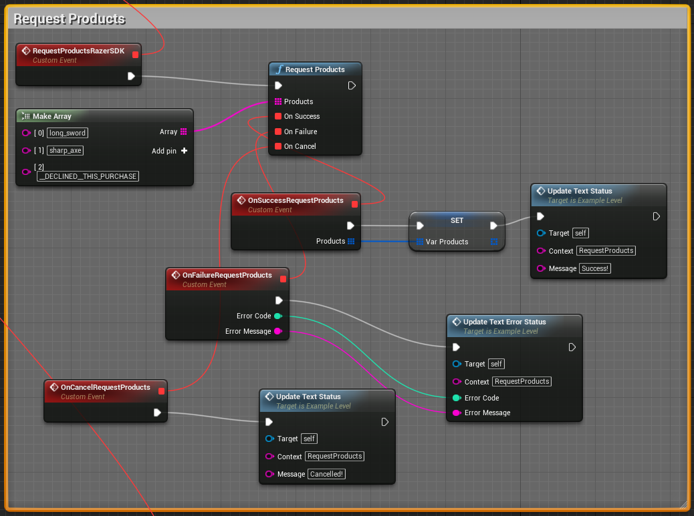
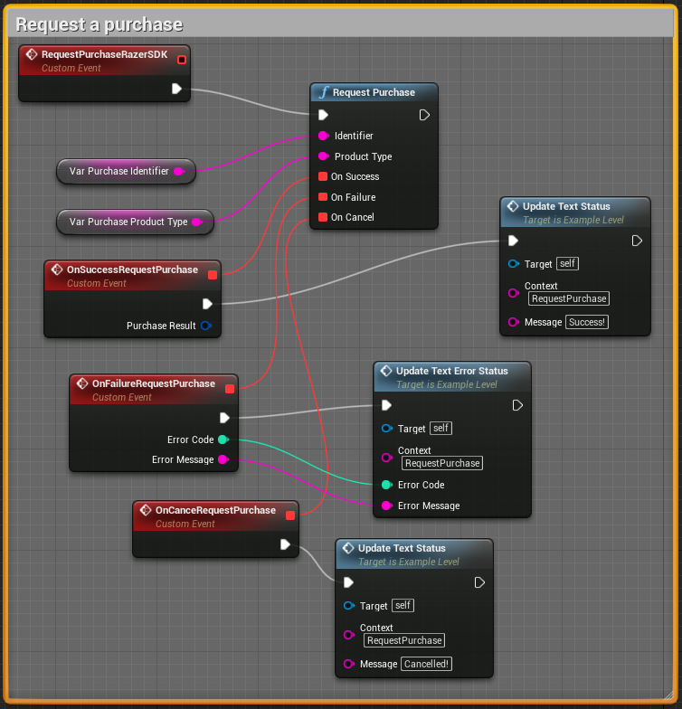
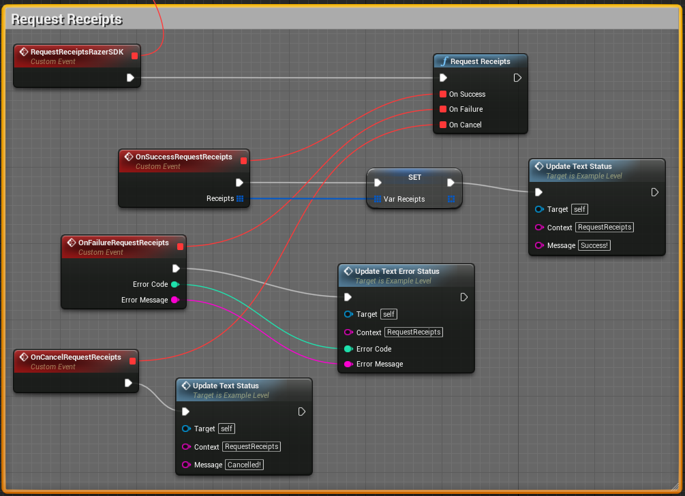

# Unreal Game Engine

The [RazerSDK](https://github.com/razerofficial/razer-sdk-docs) can be accessed via the `RazerSDK UE4 Plugin`.

## Forums #

* [Forge TV on Razer Forums](https://insider.razerzone.com/index.php?forums/razer-forge-tv.126/)

* [UnrealEngine Forums](https://forums.unrealengine.com/forum.php)

## Resources

* Get the [Unreal Engine](https://www.unrealengine.com/what-is-unreal-engine-4) - Unreal Engine and Source, All for 5% of Revenue after more than $3k gross revenue

* [Unreal Forum Post](https://forums.unrealengine.com/showthread.php?51910-Getting-Started-Android-Development-References-Documentation-Feedback) - Unreal - Tracking `Cortex` Plugin process and requests for info

* [UE4 Video Tutorials](http://docs.unrealengine.com/latest/INT/Videos/) - Unreal - Unreal 4 Documentation

* [UE4 Video Playlist](https://wiki.unrealengine.com/Category:Epic_Video_Playlists) - Unreal - Epic Video Playlists

* [UE4 Programming Playlist](https://wiki.unrealengine.com/Introduction_to_UE4_Programming_Playlist) - Unreal - Introduction to UE4 Programming Playlist

* [Android Quick Start](https://docs.unrealengine.com/latest/INT/Platforms/Android/GettingStarted/index.html) - Unreal - Documentation steps for getting started with Unreal

* [Android Reference Guide](https://docs.unrealengine.com/latest/INT/Platforms/Android/Reference/index.html) - Unreal - Environment variable setup for Android publishing

* [Blueprints](https://docs.unrealengine.com/latest/INT/Engine/Blueprints/UserGuide/Types/ClassBlueprint/index.html) - Unreal - Visual Scripting

* [Introduction to Paper2D](https://docs.unrealengine.com/latest/INT/Videos/Player/index.html?series=PLZlv_N0_O1gauJh60307mE_67jqK42twB&video=w5I3ljBJKa0) - Unreal - Intro to 2D sprites

* [Unreal Slackers](http://join.unrealslackers.org/) is the largest Unreal Engine [slack channel](https://unrealslackers.slack.com) where more than 2,000 developers trade ideas and support each other.

* [Unreal Chat](http://webchat.freenode.net/?channels=%23unrealengine) - #UnrealEngine on Freenode

* [C# for Unreal Engine](http://mono-ue.github.io/) - Write gameplay, AI, UI elements, and more  with C#

* [Zeef Resource Page](http://unreal-engine-4.zeef.com) - Tons of Unreal resource links

* [Master Unreal Blueprints](https://forums.unrealengine.com/showthread.php?10221-BOOK-Blueprints-Master-the-Art-of-Unreal-Engine-4-Blueprints) - Books and other resources for mastering Blueprints

* [Syncing Remote Fork](https://help.github.com/articles/syncing-a-fork/) - As EpicGames releases branch updates, the fork needs to be synced

### Training and Jams

* [Training Streams](https://forums.unrealengine.com/showthread.php?53457-Twitch-NEW!-Training-Stream-Spline-and-Spline-Mesh-Components-Dec-9-2014) happen Tuesdays for Q&A training sessions.

* Weekly [Unreal Twitch Stream](http://www.twitch.tv/unrealengine)

* [Game Jams](https://forums.unrealengine.com/showthread.php?53417-DECEMBER-GAME-JAM-Theme-Announced-on-Dec-11th-Twitch-Stream!&highlight=game+jam) - Epic hosts monthly game jams.

* [Answer Hub](https://answers.unrealengine.com/index.html) is the best way to get your questions about UE4 answered. 

### Documentation

* Coding Documentation: [Delegates](https://docs.unrealengine.com/latest/INT/Programming/UnrealArchitecture/Delegates/index.html)

* Coding Documentation: [Functions](https://docs.unrealengine.com/latest/INT/Programming/UnrealArchitecture/Reference/Functions/index.html)

* Coding Documentation: [Properties/Core Data Types](https://docs.unrealengine.com/latest/INT/Programming/UnrealArchitecture/Reference/Properties/index.html)

* [Artificial Intelligence](https://docs.unrealengine.com/latest/INT/Gameplay/AI/index.html) - AI Overview and Behavior Tree Quick Start Guide

* [JNI Spec](http://docs.oracle.com/javase/6/docs/technotes/guides/jni/spec/functions.html) - UE4 to Android communication uses the JNI specification

* [BLUI](https://forums.unrealengine.com/showthread.php?58192-PLUGIN-BLUI-Open-Source-HTML5-JS-CSS-HUD-UI-Release-1-0!) - BLUI is an open-source HTML renderer to make fancy UIs by embedding a browser into UE4   

## Quick Start

* First you need an [Unreal](http://unrealengine.com) account

* Link your Github account with your Unreal account per the [wiki instructions](https://wiki.unrealengine.com/GitHub_Setup#GitHub_Account)

* Only after linking your Github account will you have access to the [UE4 Source](https://github.com/EpicGames/UnrealEngine).

* Clone the [UE4 Source](https://github.com/EpicGames/UnrealEngine) branch `4.11` or better.

* Run the `Setup.bat` batch file to install the dependencies for `UnrealEngine`.

* Run the `GenerateProjectFiles.bat` batch file to generate the `Visual Studio` project files for `UnrealEngine`.

* Open the `UE4.sln` solution in `Visual Studio 2015`.

* In `Visual Studio 2015` choose the `Solution Configuration` with `Development` on `Solution Platform` with `Win64`.

* The menu item `Debug->Start Without Debugging` will launch the `Unreal Editor`.

* The `UnrealEngine` built from source will be registered and then exit the `Unreal Editor/Launcher`.

* Switch to an example project within this repository.

* Right-Click the example `.upropject` file and choose `Switch Unreal Engine Version...` with `Source build` of Unreal 4.11 or better.

* Right-Click the example `.upropject` file and choose `Genererate Visual Studio project files`.

* Open `.sln` file with `Visual Studio 2015`.

* In `Visual Studio 2015` choose the `Solution Configuration` with `DebugGame Editor` on `Solution Platform` with `Win64`.

* The menu item `Debug->Start Without Debugging` will launch the `Unreal Editor`.

* In Unreal Editor, select the `File->Package Project->Android->Android (DTX)` menu item.

* After the successful build, run the example install batch file in the output folder `Android_DXT\Install_Example_Development-armv7-es2.bat` which installs the APK on the connected `ADB` device.

## Import Plugin

* Copy the `RazerSDKPlugin` to your project's `Plugins\RazerSDKPlugin` folder.

* Click the menu item `Edit->Plugins`.

* Collapse the `Built-In` Plugins.

* Select the `Project` Plugins.

* Make sure the `RazerSDK Plugin` has `Enabled` checked.

** Note: If you build for `Android` before setting the package name then the `Intermediate\Android\APK\src\com\YourCompany` folder will need to be removed manually before rebuilding. **

## Leanback Icon

* In order to support the `leanback` icon and the `android:isGame` attribute on the `application` element, API `21` or higher should be assigned in the `Android SDK/NDK` project settings.

* Note: For API `21` the `JAVA_HOME` environment variable should be set to use `JDK8` with the path set to something similar to `C:\Program Files\Java\jdk1.8.0_73`. Setting `JAVA_HOME` requires a reboot. The `Location of JAVA` in the `Android SDK` dialog should also be set to the `JDK8` path.

## Examples

### RazerSDKExample

The [RazerSDKExample](https://github.com/razerofficial/ue4-plugin-razer-sdk/tree/master/RazerSDKExample) sample is an `Unreal C++/Blueprint project`. This project has the minimal `RazerSDK` initialization and shutdown code required for games which can be found in the level blueprint.

* The `Blueprints\ExampleWidget_BP` defines the example UI layout.

* Open the level in `Levels\ExampleLevel`.

* Open the level blueprint.

The `BeginPlay` event invokes the `Initize Razer SDK` and `Setup UI` custom events.

The `InitizeRazerSDK` custom event invokes the `RazerSDK/InitPlugin` function.

The `InitPlugin` function delegates are hooked up to display the results in a `TextBlock` using the `UpdateTextStatus` and `UpdateTextErrorStatus` custom events.  

The `SetupUI` custom event invokes the `Create UIWidget` and `Setup Button Events` custom events.

The `CreateUIWidget` custom event invokes the `Create Example Widget BP Widget` and `Add to Viewport` functions.

The `SetupButtonEvents` custom event invokes the `Bind Event to OnPressed` which binds the `Shutdown Button` to the `ShutdownRazerSDK` custom event.

The `ShutdownRazerSDK` custom event invokes `RazerSDK/Shutdown` function.

The `OnSuccessShutdown` delegate invokes the `RazerSDK/Quit` function.

### InAppPurchases

The [InAppPurchases](https://github.com/razerofficial/ue4-plugin-razer-sdk/tree/master/InAppPurchases) sample is an `Unreal C++/Blueprint project`. The sample expands on the `RazerSDKExample` and uses `IAP` functions.

 

* The `Blueprints\ProductWidget_BP` defines the layout for the product items which is a `Button` with a child `TextBlock`.

* The `Blueprints\ReceiptWidget_BP` defines the layout for receipt items which is a `TextBlock`.

* The `Blueprints\ExampleWidget_BP` defines the example UI layout.

* Open the level in `Levels\ExampleLevel`.

* Open the level blueprint.

The `Request Products`, `Request Receipts`, `Request Login`, and `Request GamerInfo` buttons can use the same binding mechanism as the `Shutdown` button.

The `Purchase` buttons need special handling to check for the pressed state using the `Event Tick` event. This is a workaround because the `OnPressed` delegate doesn't provide the `Button` sender as a parameter. The `OnPressed` binding indicates that a `Button` was pressed, but doesn't indicate which `Button` was pressed. 

The `Event Tick` event invokes the `Update Products UI On Render Thread`, `Update Receipts UI On Render Thread`, and `Tick Check Product Buttons` so that UI manipulation happens on the `MainThread`. The `RazerSDK` callbacks occur outside the `MainThread` and the `Event Tick` event needs to handle changes to the UI.

The `OnSuccessRequestProducts` delegate sets the `Var_Products` variable so that the `MainThread` can update the UI.

The `OnSuccessRequestReceipts` delegate sets the `Var_Receipts` variable so that the `MainThread` can update the UI.

The `OnSuccessGamerInfo` delegate is able to set the `GamerInfo TextBlock` outside the `MainThread` without throwing an assertion.

The `OnSuccessShutdown` delegate is able to set the `Status TextBlock` outside the `MainThread` without throwing an assertion.

The `UpdateProductsUIOnRenderingThread` custom event dynamically creates `Buttons` that can be `pressed` to call the `RazerSDK/RequestPurchase` function.

The `UpdateReceiptsUIOnRenderingThread` custom event dynamically creates `TextBlocks` to display the receipts. 

## Razer SDK

The `RazerSDK` can be accessed using the `RazerSDK UE4 Plugin` which provides a `Blueprint Library`.

### OnFailure

All `OnFailure` delegates return an `int errorCode` and `FString errorMessage` when used by `RazerSDK` function calls.

### OnCancel

All `OnCancel` delegates have no parameters when used by `RazerSDK` function calls.

### InitPlugin

See the [RazerSDK Documentation](https://github.com/razerofficial/razer-sdk-docs) for details on how to obtain the `Secret API Key`.

The `RazerSDK/InitPlugin` function takes a `FString` parameter for `SecretApiKey`. This `FString` can be copied and pasted directly from the game's `Secret API Key`. The `OnSuccess` delegate is invoked if the `RazerSDK` is initialized successfully. The `OnFailure` delegate is invoked if the `RazerSDK` fails to initialize.

### RequestLogin

`RequestLogin` opens a login dialog to sign in the user. This method should only be invoked after the `RazerSDK` has successfully initialized. The `RazerSDK/RequestGamerInfo` function takes only the delegate result parameters. The `OnSuccess` delegate is invoked if the operation completes successfully. The `OnFailure` delegate is invoked if the operation failed. The `OnCancel` delegate is invoked if the operation was canceled. The `OnSuccess` delegate indicates the user has signed in or the user was already signed in. The `OnFailure` delegate indicates there was a problem signing in. The `OnCancel` delegate indicates that the user canceled signing in.

### RequestGamerInfo

`RequestGamerInfo` returns the `GamerInfo` for the logged in user. This method should only be invoked after the `RazerSDK` has successfully initialized. The `RazerSDK/RequestGamerInfo` function takes only the delegate result parameters. The `OnSuccess` delegate is invoked if the operation completes successfully. The `OnFailure` delegate is invoked if the operation failed. The `OnCancel` delegate is invoked if the operation was canceled. The `OnSuccess` delegate receives a `FRazerSDK_GamerInfo` structure. The `FRazerSDK_GamerInfo` structure provides the `Username` and `Uuid` fields. The `OnFailure` delegate will be invoked if the user is not logged in. 

### RequestProducts

`RequestProducts` returns the product information given an array of `identifiers`. This method should only be invoked after the `RazerSDK` has successfully initialized. The `RazerSDK/RequestProducts` function takes an array of `FString` objects for the `products` parameter. The `FString` array can contain `identifiers` that are `ENTITLEMENTS` and `CONSUMABLES`. The `OnSuccess` delegate is invoked if the operation completes successfully. The `OnFailure` delegate is invoked if the operation failed. The `OnCancel` delegate is invoked if the operation was canceled. The `OnSuccess` delegate receives an array of `FRazerSDK_Product` structures. The `FRazerSDK_Product` structure provides the `Identifier`, `Name`, `Description`, `Local Price`, `Product Type` and several other fields.

### RequestPurchase

`RequestPurchase` initiates a purchase for the logged in user given the `identifier` and `product type`. The `product type` can be `ENTITLEMENT` or `CONSUMABLE`. This method should only be invoked after the `RazerSDK` has successfully initialized. The `RazerSDK/RequestPurchase` function takes a `FString` for the `identifier` and `product type` parameters. Entitlements and consumables need to correspond to the items that were created in the [developer portal](https://devs.ouya.tv). The `OnSuccess` delegate is invoked if the operation completes successfully. The `OnFailure` delegate is invoked if the operation failed. The `OnCancel` delegate is invoked if the operation was canceled. The `OnSuccess` delegate receives a `FRazerSDK_PurchaseResult` structures. The `FRazerSDK_PurchaseResult` structure provides the `Identifier` that was just purchased by the logged in user. The `OnFailure` delegate will be invoked if the user is not logged in.

### RequestReceipts

`RequestReceipts` returns all the `ENTITLEMENT` receipts for the logged in user. This method should only be invoked after the `RazerSDK` has successfully initialized. The `RazerSDK/RequestReceipts` function takes only the delegate result parameters. The `OnSuccess` delegate is invoked if the operation completes successfully. The `OnFailure` delegate is invoked if the operation failed. The `OnCancel` delegate is invoked if the operation was canceled. The `OnSuccess` delegate receives an array of `FRazerSDK_Receipt` structures. The `FRazerSDK_Receipt` structure provides the `Identifier`, `LocalPrice`, and several other fields. The `OnFailure` delegate will be invoked if the user is not logged in.

### Shutdown

This method should only be invoked after the `RazerSDK` has successfully initialized. The `RazerSDK/Shutdown` function takes only the delegate result parameters. The `OnSuccess` delegate is invoked if the operation completes successfully. The `OnFailure` delegate is invoked if the operation failed.

** Image below **

### Quit

This method should only be invoked after the `RazerSDK` has been shutdown if the `RazerSDK` had successfully initialized. The `RazerSDK/Quit` function will immediately exit the `UE4 Application`.

